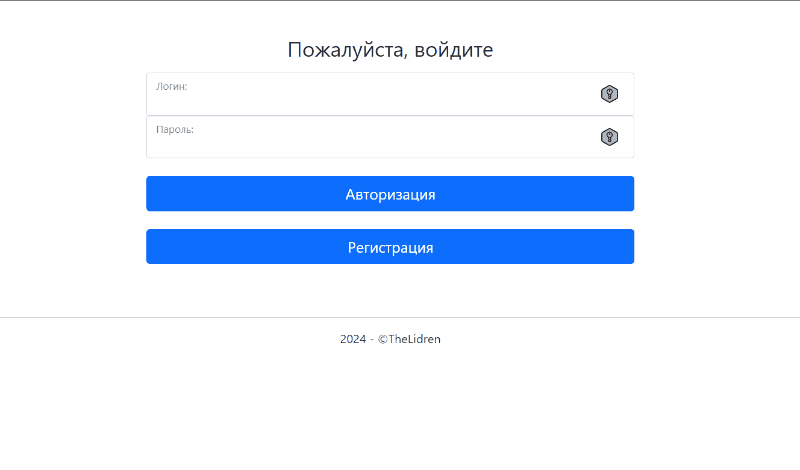
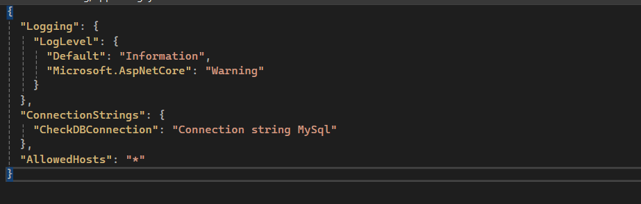

# Чек-лист
Чек-лист (CheckList) — веб-сайт, позволяющий настроить список заданий для каждой рабочей смены[^1]. 

### Содержание
- [Назначение](#why)
- [Установка](#install)
- [Применение](#apply)
- [Лицензия](#license)

#### Назначение:

Чек-лист выполняет следующие функции:
+ аутентификация пользователя (авторизация, регистрация пользователя в базе данных MySql);
+ авторизация пользователя по ролям (установка прав доступа для авторизованного сотрудника);
+ рассылка push-уведомлений[^2] о выполнении задания;
+ сортировка, фильтрация заданий;
+ сброс, изменение пароля;
+ просмотр журнала выполненных заданий.

#### Установка:

Веб-сайт должен быть развёрнут в сети Интернет или локальной сети веб-сервера.
Для корректной работы также необходимо указать корректную строку подключения к БД MySql

Технологии и компоненты: Asp.Net Core, Entity Framework Core, C#, Bootstrap, HTML5, CSS3, JavaScript

#### Применение:

Внедрение проекта позволило:
- повысить качество работы сотрудников;
- обеспечить структирование заданий по конкретным разделам (сменам);
- обеспечить логгирование выполненных заданий по каждому пользователю;
- упростить обучение и освоение новым сотрудникам. 

#### Лицензия:

> GitHub [@TheLidren](https://github.com/TheLidren)
LinkedIn [@Vladislav Misevich](https://by.linkedin.com/in/thelidren/ru)

[^1]: Группа людей, работающая в этот промежуток.
[^2]: Короткое сообщение, всплывающее на экране компьютера с некоторой информацией.
